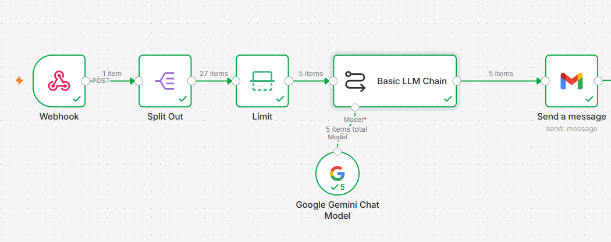
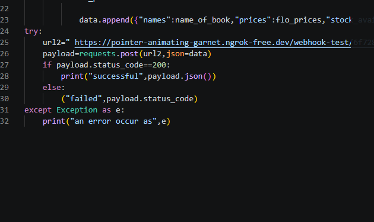
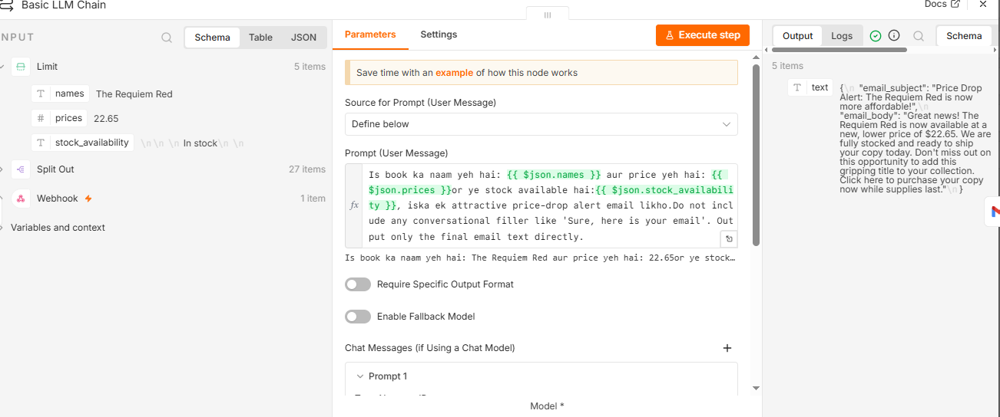

# AI Price Drop Alert Automation

An AI-powered price monitoring and email notification project that combines Python web scraping with n8n workflow automation, Google Gemini, and Gmail.

The Python scraper collects book information such as title, price, and stock availability from Books to Scrape. The collected data is then sent to an n8n webhook, processed through an automation workflow, analyzed using Google Gemini, and converted into an email notification that is sent through Gmail.

This project was built as part of my journey toward learning **Python, AI Automation, n8n, APIs, Webhooks, AI Agents, and practical workflow automation**.

## 🚀 Project Overview

This project demonstrates how a Python web scraper can be connected with an AI-powered automation workflow.

The system collects book information, sends the data to n8n, processes selected items, uses Google Gemini to generate a price-drop alert message, and sends the final message through Gmail.

The complete workflow is:

```text
Python Web Scraper
        ↓
     Webhook
        ↓
     Split Out
        ↓
       Limit
        ↓
   Google Gemini
        ↓
      Gmail
```

## ✨ Features

- Scrapes book information using Python
- Extracts book names, prices, and stock availability
- Uses Requests for HTTP requests
- Uses BeautifulSoup for HTML parsing
- Sends scraped data to an n8n webhook
- Processes incoming data using n8n
- Uses Split Out to process individual records
- Limits the number of items processed
- Uses Google Gemini for AI-generated email content
- Automatically generates price-drop alert messages
- Sends notifications through Gmail
- Demonstrates Python + AI + workflow automation integration

## 🛠️ Technologies Used

- Python
- Requests
- BeautifulSoup
- n8n
- Webhooks
- Google Gemini
- Gmail
- HTTP POST Requests
- JSON
- Git
- GitHub

## 🔄 How It Works

### 1. Python Web Scraper

The Python script sends requests to the Books to Scrape website and uses BeautifulSoup to extract book information.

The scraper collects:

- Book name
- Book price
- Stock availability

The collected information is stored in structured Python data.

### 2. Send Data to n8n Webhook

After collecting the required information, Python sends the data to an n8n Webhook using an HTTP POST request.

This allows the Python scraper to communicate directly with the automation workflow.

### 3. Split Out the Data

The n8n Split Out node processes the incoming data and separates the individual book records.

This allows each book to be handled as a separate item in the workflow.

### 4. Limit the Data

The Limit node controls how many items continue through the workflow.

In this project, the workflow processes a limited number of items before sending them to the AI step.

### 5. Google Gemini AI

The processed book information is passed to a Basic LLM Chain using the Google Gemini Chat Model.

Gemini receives information such as:

- Book name
- Price
- Stock availability

The AI is instructed to create a price-drop alert email based on the provided information.

### 6. Send Email with Gmail

The generated message is then passed to Gmail.

Gmail automatically sends the final price-drop notification email.

## 🔁 Automation Workflow

```text
Python Scraper
      ↓
n8n Webhook
      ↓
Split Out
      ↓
Limit
      ↓
Basic LLM Chain
      ↓
Google Gemini Chat Model
      ↓
Gmail
```

## 📸 Project Screenshots

### n8n Automation Workflow



### Python Web Scraper




### AI Email Generation



## ⚙️ Installation

Follow these steps to run the project locally.

### 1. Clone the repository

```bash
git clone https://github.com/YOUR-USERNAME/ai-price-drop-alert-automation.git
```

### 2. Open the project folder

```bash
cd ai-price-drop-alert-automation
```

### 3. Install required libraries

```bash
pip install requests beautifulsoup4
```

### 4. Run the Python scraper

```bash
python n8n23.py
```

> Make sure Python is installed on your computer before running the project.

## 🔧 n8n Setup

To use the complete automation workflow:

1. Create an n8n workflow.
2. Add a Webhook node.
3. Connect the Webhook to a Split Out node.
4. Add a Limit node.
5. Add a Basic LLM Chain.
6. Connect a Google Gemini Chat Model.
7. Connect the AI output to Gmail.
8. Configure the required credentials.
9. Update the Python webhook URL.
10. Test the complete workflow.

## 🧠 What I Learned

By building this project, I practiced and improved my understanding of:

- Python web scraping
- Requests and HTTP requests
- BeautifulSoup and HTML parsing
- Python lists and dictionaries
- JSON data handling
- HTTP POST requests
- Webhooks
- n8n workflow automation
- Data processing with n8n
- Connecting Python with n8n
- Using Google Gemini in an automation workflow
- AI-generated content
- Gmail automation
- Building practical AI automation workflows
- Git and GitHub
- Documenting projects professionally

## 🎯 Portfolio Goal

This project is part of my journey toward becoming an **AI Automation Freelancer**.

My goal is to build practical projects that demonstrate real-world skills in:

- Python
- Web Scraping
- APIs
- Webhooks
- n8n
- Workflow Automation
- Generative AI
- AI Automation
- AI Agents

I am building and documenting practical projects on GitHub to create a professional portfolio that can demonstrate my skills and work to potential freelance clients.

My focus is not only on learning concepts theoretically, but also on building real-world automation projects and gradually developing the skills needed for professional automation work.

## 🔮 Future Improvements

This project can be improved further by adding:

- Automatic scheduled price monitoring
- Scraping more websites
- Monitoring specific books
- Storing price history
- Detecting actual price changes
- Sending alerts only when a price decreases
- Saving data to Google Sheets or a database
- Adding Telegram or WhatsApp notifications
- Adding better error handling
- Adding workflow failure notifications
- Using environment variables for configuration
- Building a more advanced AI-powered price monitoring agent

## 📌 Project Status

**Status:** Completed for learning and portfolio purposes

**Level:** Intermediate

**Focus:** Python Web Scraping + n8n + Generative AI + Email Automation

## ⚠️ Disclaimer

This project was created for educational and learning purposes.

The website used in this project is a practice website designed for learning web scraping.

This project is not affiliated with or endorsed by the website, Google, Gmail, n8n, or any other third-party service.

## 👨‍💻 Author

Created as part of my journey to learn **Python, AI Automation, n8n, and practical workflow automation** and to build a professional GitHub portfolio.
